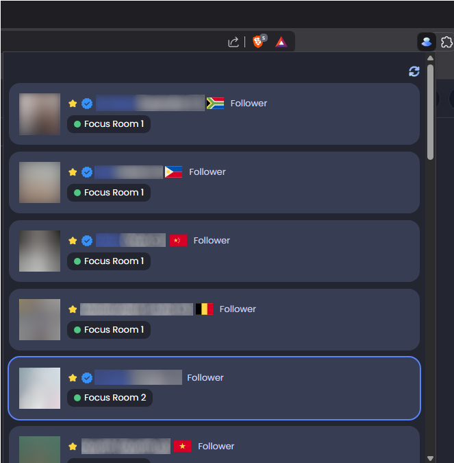

# StudyStream Buddies

StudyStream Buddies is a simple Chrome extension for [StudyStream](https://www.studystream.live/)
that provides the following additional features:

- Shows all followed users who are currently online in focus rooms.
- Displays a notification when a favourite followed user enters a focused room.
- Highlights followed users who are currently pinning you (requires a premium subscription).
- Displays a notification when anyone pins you (requires a premium subscription).
- Shows which followed users have their cameras enabled (requires a premium subscription).
- Always shows the premium tick for followed users with premium subscriptions, even if the
  tick is hidden.
- Shows the non-private timezones of followed users who do not have their countries set in
  their profiles, or if their countries do not match their timezone settings.
- Removes video blurring, allowing you to see users' video tiles regardless of their settings.

## How to install

This extension is not available in the Chrome Web Store. To install it:

- Download the source code ZIP file for the [latest release](https://github.com/mpaulse/studystream-buddies/releases/latest)
  and extract it into a local directory of your choice. Alternatively, clone this repository to a
  local directory.
- Go to the **Extensions** page by clicking the **Extensions** toolbar button and selecting
  **Manage Extensions**. Alternatively, select **Extensions > Manage Extensions** from
  the web browser menu or enter "chrome://extensions" into the URL search bar.
- Enable **Developer mode**.
- Click the **Load unpacked** button.
- Select the **app** directory that was extracted from the source code ZIP file or pulled
  from this repository.

To install an updated version:
- Download the source code ZIP file for the [latest release](https://github.com/mpaulse/studystream-buddies/releases/latest)
  and extract it into the same local directory as before. Alternatively, pull
  the latest updates from this repository.
- Click the **Reload** button for the extension on the **Extensions** page.
