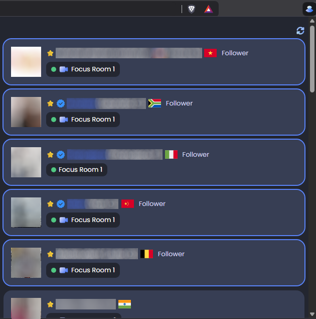

# StudyStream Buddies

StudyStream Buddies is a simple Chrome extension for [StudyStream](https://www.studystream.live/)
that provides the following additional features:

- Shows all followed users who are currently online in focus rooms.
- Displays a notification when a favourite followed user enters a focused room.
- Highlights followed users who are currently pinning you (requires a premium subscription).
- Displays a notification when anyone pins you (requires a premium subscription).

## How to install

This extension is not available in the Chrome Web Store. To install it:

- Clone this repository to a local directory.
- Go to the **Extensions** page by clicking the **Extensions** toolbar button and selecting
  **Manage Extensions**. Alternatively, select **Extensions > Manage Extensions** from
  the web browser menu or enter "chrome://extensions" into the URL search bar.
- Enable **Developer mode**.
- Click the **Load unpacked** button.
- Select the **app** directory in this repository.

To install an updated version:
- Pull the latest updates from this repository.
- Click the **Reload** button for the extension on the **Extensions** page.
